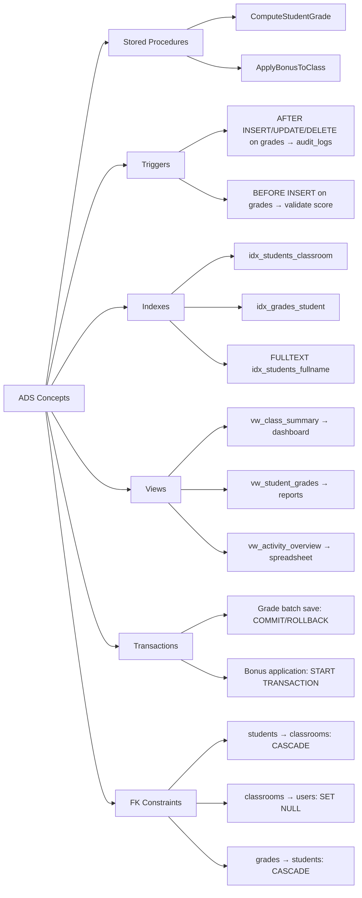

# DSA-GradeSecure — Implementation Plan (2-in-1 Project)

> A simplified grade management system inspired by GradeSecure.
> Covers **DSA** (Data Structures & Algorithms) + **ADS** (Advanced Database Systems).

---

## Overview

This project demonstrates concepts from **two courses** in a single working application:

### DSA Topics (from Flowcharts)

| # | Flowchart | Feature | DSA Concept |
|---|-----------|---------|-------------|
| 1 | **Login** | Role-based authentication (Admin vs Teacher) | Control flow, validation loop |
| 2 | **Class Creation** | Create classes, add students to roster | Loop structures, data management |
| 3 | **Spreadsheet Activity** | Encode grades, modify activities, export | CRUD operations |
| 4 | **Radix Sort + Bonus** | Sort students by grade, apply +10 curve | **Radix Sort (LSD)** — core algorithm |

### ADS Topics (from IT223 Lessons)

| # | Lesson | ADS Concept | Where It's Used |
|---|--------|-------------|-----------------|
| 1 | Weeks 1-3 | **SQL Triggers** | Audit log triggers (AFTER INSERT/UPDATE/DELETE on grades) |
| 2 | Stored Proc | **Stored Procedures** | Grade computation, bonus application, batch operations |
| 3 | Indexes & Views | **Indexes** | Performance indexes on frequently queried columns |
| 4 | Indexes & Views | **Views** | Dashboard summary views, teacher grade reports |
| 5 | Finals Lesson 1 | **Transactions** | COMMIT/ROLLBACK for safe grade batch saves |
| 6 | Finals Lesson 2 | **Foreign Key Constraints** | CASCADE, SET NULL, RESTRICT on related tables |

---

## Tech Stack

| Layer | Technology | Why |
|-------|-----------|-----|
| **Backend** | Java 17 + Spring Boot 3 | Java backend requirement |
| **Frontend** | HTML + CSS + JS + Bootstrap 5 | Simple, no build tooling needed |
| **Database** | MySQL 8+ | ADS requirement — needed for triggers, stored procs, views |
| **API Style** | REST (JSON) | Frontend communicates via `fetch()` |
| **DSA Highlight** | Radix Sort (LSD) | Core algorithm in the sorting feature |
| **ADS Highlights** | Triggers, Stored Procs, Indexes, Views, Transactions, FK Constraints | All 6 ADS concepts demonstrated |

> [!NOTE]
> Using MySQL for persistent data storage. Make sure you have MySQL 8+ running locally (e.g., via Laragon, XAMPP, or standalone). The app will auto-create tables on first run via JPA/Hibernate.

---

## Project Structure

```
C:\Users\user\Documents\GitHub\DSA-Project\
│
├── backend/                              # Spring Boot REST API
│   ├── src/main/java/com/gradesecure/
│   │   ├── GradeSecureApplication.java
│   │   ├── config/
│   │   │   ├── CorsConfig.java
│   │   │   └── SecurityConfig.java
│   │   ├── controller/
│   │   │   ├── AuthController.java       # Login/logout (Flowchart 3)
│   │   │   ├── ClassController.java      # Class CRUD (Flowchart 1)
│   │   │   ├── StudentController.java    # Student roster (Flowchart 1)
│   │   │   ├── GradeController.java      # Grade encoding (Flowchart 2)
│   │   │   ├── SortController.java       # Radix sort + bonus (Flowchart 4)
│   │   │   └── AuditController.java      # View audit logs (ADS: Triggers)
│   │   ├── model/
│   │   │   ├── User.java
│   │   │   ├── ClassRoom.java
│   │   │   ├── Student.java
│   │   │   ├── Activity.java
│   │   │   ├── Grade.java
│   │   │   └── AuditLog.java             # ★ ADS: populated by triggers
│   │   ├── repository/
│   │   │   ├── UserRepository.java
│   │   │   ├── ClassRoomRepository.java
│   │   │   ├── StudentRepository.java
│   │   │   ├── ActivityRepository.java
│   │   │   ├── GradeRepository.java
│   │   │   └── AuditLogRepository.java
│   │   ├── service/
│   │   │   ├── AuthService.java
│   │   │   ├── ClassService.java
│   │   │   ├── GradeService.java         # ★ ADS: calls stored procedures
│   │   │   └── RadixSortService.java     # ★ DSA: Radix Sort implementation
│   │   └── dto/
│   │       ├── LoginRequest.java
│   │       ├── LoginResponse.java
│   │       └── SortResponse.java
│   ├── src/main/resources/
│   │   ├── application.properties        # MySQL connection config
│   │   ├── data.sql                      # Seed data (default admin + teacher)
│   │   └── schema.sql                    # ★ ADS: Triggers, Stored Procs, Views, Indexes
│   ├── build.gradle
│   ├── settings.gradle
│   └── gradlew / gradlew.bat
│
├── frontend/                             # Static HTML/CSS/JS + Bootstrap
│   ├── index.html                        # Login page
│   ├── dashboard.html                    # Dashboard (role-aware)
│   ├── classes.html                      # Class creation & roster
│   ├── spreadsheet.html                  # Grade spreadsheet
│   ├── sort.html                         # Radix sort visualization
│   ├── audit.html                        # Audit log viewer (ADS demo)
│   ├── css/
│   │   └── style.css
│   └── js/
│       ├── api.js                        # API helper (fetch wrapper)
│       ├── auth.js                       # Login/logout/session
│       ├── classes.js                    # Class & student CRUD
│       ├── spreadsheet.js                # Grade encoding & export
│       ├── sort.js                       # Radix sort + bonus UI
│       └── audit.js                      # Audit log display
│
├── sql/                                  # ★ ADS: All SQL scripts (for documentation/demo)
│   ├── 01_schema.sql                     # Table creation with FK constraints
│   ├── 02_indexes.sql                    # Index creation
│   ├── 03_views.sql                      # View definitions
│   ├── 04_stored_procedures.sql          # Stored procedure definitions
│   ├── 05_triggers.sql                   # Trigger definitions
│   └── 06_seed_data.sql                  # Initial data
│
├── flowcharts/                           # Draw.io flowcharts (already created)
│   ├── class_creation.drawio
│   ├── spreadsheet_activity.drawio
│   ├── login.drawio
│   └── radix_sort_bonus.drawio
│
└── README.md
```

---

## Database Schema

### Tables (with Foreign Key Constraints — ADS Lesson: Finals 2)

```sql
-- ★ ADS: Foreign Key Constraints with referential actions

CREATE TABLE users (
    id BIGINT AUTO_INCREMENT PRIMARY KEY,
    username VARCHAR(50) NOT NULL UNIQUE,
    password VARCHAR(255) NOT NULL,
    full_name VARCHAR(100) NOT NULL,
    role ENUM('ADMIN', 'TEACHER') NOT NULL,
    created_at TIMESTAMP DEFAULT CURRENT_TIMESTAMP
);

CREATE TABLE classrooms (
    id BIGINT AUTO_INCREMENT PRIMARY KEY,
    name VARCHAR(100) NOT NULL,
    teacher_id BIGINT,
    created_at TIMESTAMP DEFAULT CURRENT_TIMESTAMP,
    -- ★ ADS: SET NULL on teacher deletion (teacher removed but class preserved)
    FOREIGN KEY (teacher_id) REFERENCES users(id) ON DELETE SET NULL ON UPDATE CASCADE
);

CREATE TABLE students (
    id BIGINT AUTO_INCREMENT PRIMARY KEY,
    full_name VARCHAR(100) NOT NULL,
    classroom_id BIGINT NOT NULL,
    created_at TIMESTAMP DEFAULT CURRENT_TIMESTAMP,
    -- ★ ADS: CASCADE on class deletion (students removed with class)
    FOREIGN KEY (classroom_id) REFERENCES classrooms(id) ON DELETE CASCADE ON UPDATE CASCADE
);

CREATE TABLE activities (
    id BIGINT AUTO_INCREMENT PRIMARY KEY,
    name VARCHAR(100) NOT NULL,
    classroom_id BIGINT NOT NULL,
    max_score DECIMAL(5,2) NOT NULL,
    -- ★ ADS: CASCADE (activities removed with class)
    FOREIGN KEY (classroom_id) REFERENCES classrooms(id) ON DELETE CASCADE ON UPDATE CASCADE
);

CREATE TABLE grades (
    id BIGINT AUTO_INCREMENT PRIMARY KEY,
    student_id BIGINT NOT NULL,
    activity_id BIGINT NOT NULL,
    score DECIMAL(5,2) DEFAULT NULL,
    -- ★ ADS: CASCADE (grades removed when student or activity is deleted)
    FOREIGN KEY (student_id) REFERENCES students(id) ON DELETE CASCADE ON UPDATE CASCADE,
    FOREIGN KEY (activity_id) REFERENCES activities(id) ON DELETE CASCADE ON UPDATE CASCADE,
    UNIQUE KEY uk_student_activity (student_id, activity_id)
);

-- ★ ADS: Audit log table (populated by triggers, not by application code)
CREATE TABLE audit_logs (
    id BIGINT AUTO_INCREMENT PRIMARY KEY,
    table_name VARCHAR(50) NOT NULL,
    action_type ENUM('INSERT', 'UPDATE', 'DELETE') NOT NULL,
    record_id BIGINT NOT NULL,
    old_values JSON DEFAULT NULL,
    new_values JSON DEFAULT NULL,
    performed_at TIMESTAMP DEFAULT CURRENT_TIMESTAMP
);
```

### Indexes (ADS Lesson: Indexes & Views)

```sql
-- ★ ADS: Indexes for query performance

-- Regular index: speed up lookups by teacher
CREATE INDEX idx_classrooms_teacher ON classrooms(teacher_id);

-- Regular index: speed up student lookups by class
CREATE INDEX idx_students_classroom ON students(classroom_id);

-- Regular index: speed up grade lookups
CREATE INDEX idx_grades_student ON grades(student_id);
CREATE INDEX idx_grades_activity ON grades(activity_id);

-- Unique index: prevent duplicate grades per student per activity
-- (already defined as UNIQUE KEY in table, acts as unique index)

-- Full-text index: search students by name
CREATE FULLTEXT INDEX idx_students_fullname ON students(full_name);
```

### Views (ADS Lesson: Indexes & Views)

```sql
-- ★ ADS: Views for dashboard summaries

-- View 1: Class summary with student count and teacher name
CREATE VIEW vw_class_summary AS
SELECT 
    c.id AS class_id,
    c.name AS class_name,
    u.full_name AS teacher_name,
    COUNT(s.id) AS student_count
FROM classrooms c
LEFT JOIN users u ON c.teacher_id = u.id
LEFT JOIN students s ON s.classroom_id = c.id
GROUP BY c.id, c.name, u.full_name;

-- View 2: Student grade report (average per student)
CREATE VIEW vw_student_grades AS
SELECT 
    s.id AS student_id,
    s.full_name AS student_name,
    c.name AS class_name,
    ROUND(AVG(g.score / a.max_score * 100), 2) AS average_grade
FROM students s
JOIN classrooms c ON s.classroom_id = c.id
LEFT JOIN grades g ON g.student_id = s.id
LEFT JOIN activities a ON g.activity_id = a.id
GROUP BY s.id, s.full_name, c.name;

-- View 3: Activity grade overview per class
CREATE VIEW vw_activity_overview AS
SELECT 
    a.id AS activity_id,
    a.name AS activity_name,
    c.name AS class_name,
    a.max_score,
    COUNT(g.id) AS grades_entered,
    ROUND(AVG(g.score), 2) AS avg_score
FROM activities a
JOIN classrooms c ON a.classroom_id = c.id
LEFT JOIN grades g ON g.activity_id = a.id
GROUP BY a.id, a.name, c.name, a.max_score;
```

### Stored Procedures (ADS Lesson: Stored Procedures)

```sql
-- ★ ADS: Stored Procedures with IN, OUT, INOUT parameters

-- SP 1: Compute final grade for a student (average of all activities)
DELIMITER //
CREATE PROCEDURE ComputeStudentGrade(
    IN p_student_id BIGINT,
    OUT p_final_grade DECIMAL(5,2)
)
BEGIN
    SELECT ROUND(AVG(g.score / a.max_score * 100), 2)
    INTO p_final_grade
    FROM grades g
    JOIN activities a ON g.activity_id = a.id
    WHERE g.student_id = p_student_id;
END //
DELIMITER ;

-- SP 2: Apply bonus marks to all students in a class (INOUT)
DELIMITER //
CREATE PROCEDURE ApplyBonusToClass(
    IN p_class_id BIGINT,
    IN p_bonus_amount DECIMAL(5,2),
    OUT p_students_affected INT
)
BEGIN
    DECLARE EXIT HANDLER FOR SQLEXCEPTION
    BEGIN
        ROLLBACK;
    END;
    
    -- ★ ADS: Transaction with COMMIT/ROLLBACK
    START TRANSACTION;
    
    UPDATE grades g
    JOIN students s ON g.student_id = s.id
    SET g.score = LEAST(g.score + p_bonus_amount, 
                        (SELECT max_score FROM activities WHERE id = g.activity_id))
    WHERE s.classroom_id = p_class_id;
    
    SELECT ROW_COUNT() INTO p_students_affected;
    
    COMMIT;
END //
DELIMITER ;

-- SP 3: Batch insert grades for a class (Transaction demo)
DELIMITER //
CREATE PROCEDURE BatchSaveGrades(
    IN p_class_id BIGINT
)
BEGIN
    DECLARE EXIT HANDLER FOR SQLEXCEPTION
    BEGIN
        -- ★ ADS: ROLLBACK on any error (all-or-nothing)
        ROLLBACK;
        SIGNAL SQLSTATE '45000' SET MESSAGE_TEXT = 'Batch save failed. All changes rolled back.';
    END;

    START TRANSACTION;
    -- Application inserts grades here via prepared statements
    COMMIT;
END //
DELIMITER ;
```

### Triggers (ADS Lesson: Weeks 1-3 — SQL Triggers)

```sql
-- ★ ADS: Triggers for automatic audit logging

-- AFTER INSERT on grades: log when a grade is entered
DELIMITER //
CREATE TRIGGER trg_grades_after_insert
AFTER INSERT ON grades
FOR EACH ROW
BEGIN
    INSERT INTO audit_logs (table_name, action_type, record_id, new_values)
    VALUES ('grades', 'INSERT', NEW.id,
        JSON_OBJECT('student_id', NEW.student_id, 'activity_id', NEW.activity_id, 'score', NEW.score));
END //
DELIMITER ;

-- AFTER UPDATE on grades: log when a grade is changed
DELIMITER //
CREATE TRIGGER trg_grades_after_update
AFTER UPDATE ON grades
FOR EACH ROW
BEGIN
    INSERT INTO audit_logs (table_name, action_type, record_id, old_values, new_values)
    VALUES ('grades', 'UPDATE', NEW.id,
        JSON_OBJECT('score', OLD.score),
        JSON_OBJECT('score', NEW.score));
END //
DELIMITER ;

-- AFTER DELETE on grades: log when a grade is removed
DELIMITER //
CREATE TRIGGER trg_grades_after_delete
AFTER DELETE ON grades
FOR EACH ROW
BEGIN
    INSERT INTO audit_logs (table_name, action_type, record_id, old_values)
    VALUES ('grades', 'DELETE', OLD.id,
        JSON_OBJECT('student_id', OLD.student_id, 'activity_id', OLD.activity_id, 'score', OLD.score));
END //
DELIMITER ;

-- BEFORE INSERT on grades: validate score doesn't exceed max
DELIMITER //
CREATE TRIGGER trg_grades_before_insert
BEFORE INSERT ON grades
FOR EACH ROW
BEGIN
    DECLARE v_max_score DECIMAL(5,2);
    SELECT max_score INTO v_max_score FROM activities WHERE id = NEW.activity_id;
    IF NEW.score > v_max_score THEN
        SIGNAL SQLSTATE '45000' 
        SET MESSAGE_TEXT = 'Score exceeds maximum allowed for this activity';
    END IF;
    IF NEW.score < 0 THEN
        SIGNAL SQLSTATE '45000'
        SET MESSAGE_TEXT = 'Score cannot be negative';
    END IF;
END //
DELIMITER ;
```

### Transactions (ADS Lesson: Finals 1)

Transactions are used in:
- **Stored Procedures** (see `ApplyBonusToClass` — START TRANSACTION, COMMIT, ROLLBACK)
- **Grade batch save** (all grades save or none — atomicity)
- **Class deletion** (cascading deletes happen within a transaction)
- **Java service layer** — `@Transactional` annotation on critical operations

---

## API Endpoints

### Auth (Flowchart: Login)
| Method | Endpoint | Description |
|--------|----------|-------------|
| POST | `/api/auth/login` | Validate credentials, return role + token |
| POST | `/api/auth/logout` | Invalidate session |
| GET | `/api/auth/me` | Get current user info |

### Classes (Flowchart: Class Creation)
| Method | Endpoint | Description |
|--------|----------|-------------|
| GET | `/api/classes` | List classes (uses `vw_class_summary` view) |
| POST | `/api/classes` | Create a new class |
| GET | `/api/classes/{id}/students` | Get class roster |
| POST | `/api/classes/{id}/students` | Add student to roster |
| DELETE | `/api/students/{id}` | Remove student (CASCADE deletes grades) |

### Grades (Flowchart: Spreadsheet)
| Method | Endpoint | Description |
|--------|----------|-------------|
| GET | `/api/classes/{id}/spreadsheet` | Full spreadsheet (uses views) |
| POST | `/api/classes/{id}/activities` | Add/edit activity column |
| PUT | `/api/grades` | Save grade (triggers fire for audit) |
| GET | `/api/classes/{id}/export` | Export CSV report |

### Sort (Flowchart: Radix Sort + Bonus)
| Method | Endpoint | Description |
|--------|----------|-------------|
| POST | `/api/classes/{id}/sort` | Radix Sort grades + apply bonus (calls stored proc) |
| GET | `/api/classes/{id}/sorted-roster` | Get sorted + curved roster |

### Audit (ADS: Triggers)
| Method | Endpoint | Description |
|--------|----------|-------------|
| GET | `/api/audit-logs` | View all audit logs (populated by triggers) |
| GET | `/api/audit-logs?table=grades` | Filter audit logs by table |

---

## ADS Concepts Mapping — Where Each Is Demonstrated



---

## Build Order (Phases)

### Phase 1: Database & Backend Foundation
- [ ] Initialize Spring Boot project with Gradle
- [ ] Configure MySQL connection
- [ ] Create all SQL scripts (schema, indexes, views, stored procs, triggers)
- [ ] Define JPA models + repositories
- [ ] Seed default users (admin/teacher)

### Phase 2: Auth & Class Management
- [ ] `AuthController` — login/logout with role check
- [ ] `ClassController` — CRUD (demonstrates FK constraints)
- [ ] `StudentController` — roster management (CASCADE demo)

### Phase 3: Grade Spreadsheet
- [ ] `GradeController` — activity columns + grade cells
- [ ] Integrate stored procedures for grade computation
- [ ] Triggers auto-populate audit_logs on grade changes
- [ ] CSV export endpoint

### Phase 4: Radix Sort + Bonus (DSA Core)
- [ ] `RadixSortService` — LSD Radix Sort implementation in Java
- [ ] `SortController` — trigger sort + apply bonus via stored proc
- [ ] Return step-by-step trace for visualization

### Phase 5: Frontend
- [ ] Login page (Bootstrap form + validation loop)
- [ ] Dashboard (role-aware, uses `vw_class_summary` view)
- [ ] Classes page (create class, manage roster)
- [ ] Spreadsheet page (editable grade table, export)
- [ ] Sort page (trigger sort, show step-by-step animation)
- [ ] Audit page (view trigger-populated logs)

### Phase 6: Polish
- [ ] Error handling + validation
- [ ] Responsive design
- [ ] README with ADS + DSA concept documentation

---

## Key Simplifications vs. Original GradeSecure

| Original GradeSecure | This DSA+ADS Version |
|----------------------|--------------------|
| 11 user roles | 2 roles (Admin, Teacher) |
| Laravel + Next.js + MySQL | Java Spring Boot + HTML/Bootstrap + MySQL |
| DepEd transmutation formula | Simple average + Radix Sort + bonus |
| Multi-quarter, multi-year | Single class view |
| Approval workflows | Direct save (with transaction safety) |
| SF9 report cards | Simple CSV export |
| 24 API controllers | 6 controllers |
| 18 database tables | 6 tables |
| Implicit audit logging | ★ Explicit MySQL Triggers for audit |
| ORM-only queries | ★ Stored Procedures + Views |

---

> [!NOTE]
> **All decisions finalized:**
> 1. ~~H2 or MySQL?~~ **MySQL** ✅
> 2. ~~Maven or Gradle?~~ **Gradle** ✅
> 3. ~~Step-by-step visualization?~~ **Result only** ✅
> 4. **Styling:** Dark/teal theme similar to GradeSecure
> 5. ~~Build location?~~ **`C:\Users\user\Documents\GitHub\DSA-Project`** ✅
